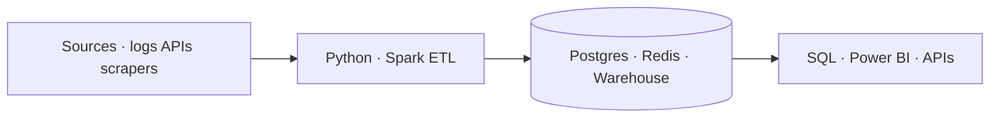

<div align="center">

  

  <p>
    
    
    
  </p>

  <strong>Data Engineer</strong> · PG Cert. Big Data Analytics @ C-DAC Mumbai

  I design ETL systems, Spark jobs, and cloud data paths that stay up.

  <p>
    <a href="https://www.linkedin.com/in/ishansri03/">LinkedIn</a>
    &nbsp;·&nbsp;
    <a href="mailto:ishan70073@gmail.com">Email</a>
    &nbsp;·&nbsp;
    <a href="https://github.com/Er-Ishan-Srivastav">GitHub</a>
    &nbsp;·&nbsp;
    <a href="https://scholar.google.com/citations?user=CDWfYp0AAAAJ&hl=en">Scholar</a>
  </p>

</div>

---

```text
role       data engineer
location   navi mumbai
now        pg cert, big data analytics @ c-dac
shipped    50gb weekly logs · 85% coverage · 96.7% uptime
status     open to data engineer roles
```

## operating metrics

<table>
  <tr>
    <td align="center" width="25%"><strong>50 GB</strong><br /><sub>weekly log volume</sub></td>
    <td align="center" width="25%"><strong>85%</strong><br /><sub>unit test coverage</sub></td>
    <td align="center" width="25%"><strong>96.7%</strong><br /><sub>system uptime</sub></td>
    <td align="center" width="25%"><strong>14</strong><br /><sub>analysts led</sub></td>
  </tr>
  <tr>
    <td align="center"><strong>~30%</strong><br /><sub>accuracy lift</sub></td>
    <td align="center"><strong>40%</strong><br /><sub>latency reduction</sub></td>
    <td align="center"><strong>1,000+</strong><br /><sub>daily API requests</sub></td>
    <td align="center"><strong><200ms</strong><br /><sub>retrieval latency</sub></td>
  </tr>
</table>

## product

**[01 — CAMAF](https://github.com/Er-Ishan-Srivastav/Adaptive-Traffic-Control-System)**  
Adaptive system control via federated learning. Real-time edge compute with YOLOv11n, BoT-SORT, and Eclipse SUMO. Trained on 19k+ instances at 95% operational accuracy. FedProx + AES-256 cut model-weight bandwidth by 90%.

`python` `yolov11` `federated-learning` `aes-256` `sumo`

**[02 — BrillX](https://github.com/Er-Ishan-Srivastav/BrillX-Saas-Learning-Platform)**  
Cloud-native SaaS backend for dynamic learning paths. Node.js + FastAPI microservices routing 1,000+ daily REST requests with sub-200ms database retrieval and automated release prep.

`node.js` `fastapi` `microservices` `aws`

**[03 — PayFlow](https://github.com/Er-Ishan-Srivastav/PayFlow-UPI-Management-System)**  
UPI transaction system with ACID semantics, concurrency control, and fraud detection. Flask + MySQL, seeded with 10k transactions and 1k users — CTEs, window functions, pytest.

`flask` `mysql` `sqlalchemy` `pytest`

## platform

| layer | stack |
| :--- | :--- |
| languages | Python, SQL, Scala, Bash |
| processing | Apache Spark, PySpark, Hadoop, Kafka, Hive |
| stores | PostgreSQL, MySQL, MongoDB, Redis, Snowflake |
| cloud | AWS, Azure, Terraform, Linux |
| quality | PyTest, CI/CD, Astro, Git, Power BI |



## changelog

**v2026.08** — *C-DAC Mumbai*  
Post Graduate Certificate in Big Data Analytics. Distributed computing, cloud, and advanced data processing.

**v2026.05 – 08** — *eClerx · Data Analyst, Team Lead*  
Led 14 analysts on a critical data-ops program. Web-scraping pipelines with validation gates. Redis processing + Astro orchestration to speed daily jobs.

**v2024.06 – 12** — *Main Flow Services · Data Analyst Intern*  
Python/SQL ETL on 50k+ records. Processed 50 GB of weekly logs. 30+ unit tests, 85% coverage, 96.7% uptime. Cut reporting latency 40%, saved 12 hours/week.

**v2022 – 26** — *Chandigarh University*  
B.E. Computer Science (Big Data Analytics). CGPA 8.21.

## papers

- **A Decentralized Multi-Agent Federated Learning Framework for Adaptive System Control** — I. Srivastav, P. Kumar Singh, A. Jaswal. Mar 2026. Submitted.
- **BrillX: An Architecture for Dynamic Learning Paths** — I. Srivastav, P. Kumar Singh, A. Jaswal. *IJIRT*, Vol. 12, Issue 6. Nov 2025.

## certifications

`Power BI Data Analyst` · `OCI Generative AI Professional` · `OCI Data Management Foundations` · `AWS Cloud Foundations`

## telemetry

<p align="center">
  
  
</p>

---

<div align="center">
  <sub>open to data engineer roles · navi mumbai · ishan70073@gmail.com</sub>
</div>
